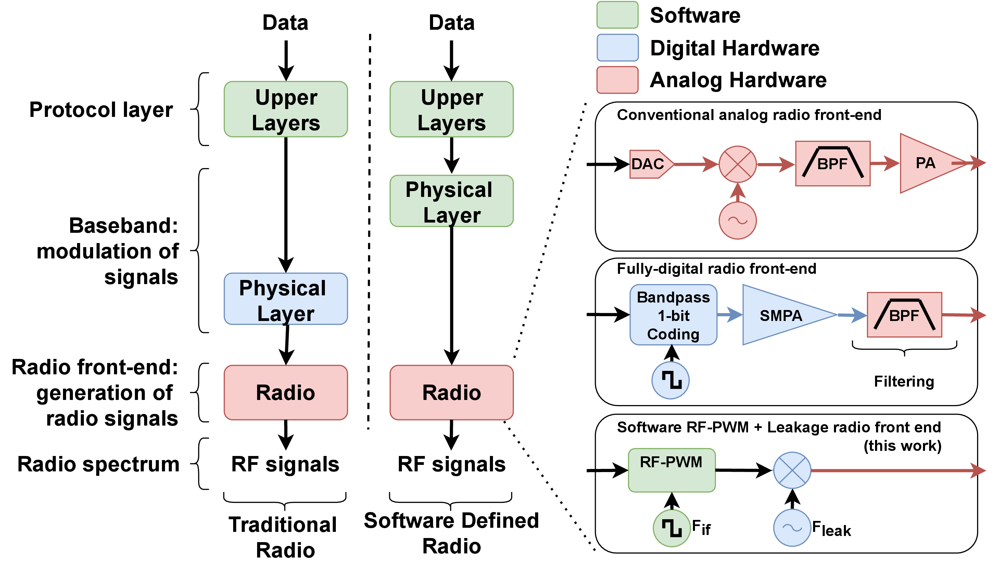
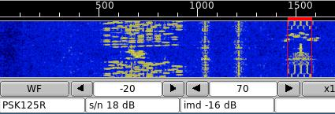
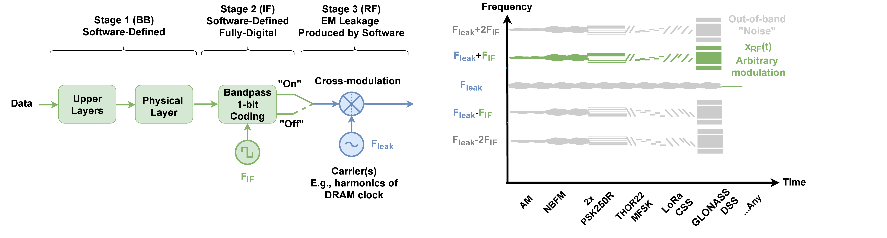

# noise-sdr

Welcome to the Noise-SDR project!

"Noise-SDR: Arbitrary Modulation of Electromagnetic Noise from Unprivileged Software and Its Impact on Emission Security" to appear at IEEE S&P 2022.

https://user-images.githubusercontent.com/17478984/129482511-21b08f37-dece-4cbf-99cd-bd8807670c84.mp4


https://user-images.githubusercontent.com/17478984/129486564-1e380eaf-2269-4824-87a5-96b00657fdaa.mp4


https://user-images.githubusercontent.com/17478984/129486578-1387bc0f-e4bc-4fef-86ec-22288ca3c146.mp4


### Noise-SDR in a nutshell

Noise-SDR uses a leakage-based fully-digital software-defined approach to shape
electromagnetic noise produced by unprivileged software into generic radio
signals, arbitrarily modulated in amplitude/frequency/phase. Despite some limitations on
power, frequency and bandwidth, it can transmit data with a variety of analog
and digital radio protocols. 
Noise-SDR currently runs on x86_64 (Linux and Windows), ARMV7A/ARMV8A (Android),
and MIPS32 (OpenWrt). Please check the academic paper for more details.

<p align="center">
   
  
</p>
<!---->
<!---->

***Note:*** This is just an initial release. You can already find the code and how to
(cross)compile it. Running fldigi-noise-sdr is straightforward (check the help menu).
We assume you have some familiarity with running code on various platforms,
EM leakage, popular SDR tools and radio protocols
(many resources online are available). We plan to follow up with more tutorials
and more detailed instructions.

### Publications

Giovanni Camurati and Aurélien Francillon, "Noise-SDR: Arbitrary Modulation of Electromagnetic Noise from Unprivileged Software and Its Impact on Emission Security", to appear at IEEE S&P 2022.

### Authors

This work was developed at [EURECOM][eurecom] by [Giovanni Camurati][gc] (now at
[ETH Zurich][eth-syssec]) and
[Aurélien Francillon][af].
Please contact [camurati@eurecom.fr](mailto:camurati@eurecom.fr) for any
question.

### Acknowledgements

We would like to thank Andrea Possemato, Giulia Clerici, Matteo Guarrera, Elie Bursztein,
Jean-Michel Picod, the anonymous reviewers and the shepherd for their feedback,
help or interesting discussions.
This work was partially supported by a Google Faculty Research Award.

We are grateful for the many online resources and open-source tools that made
our work possible, in particular:
[Fldigi][fldigi],
[GNURadio][gnuradio],
[gr-lora_sdr][gr-lora_sdr],
[gnss-sdr][gnss-sdr],
[qsstv][qsstv],
[wsjt-x][wsjt-x],
[sigidwiki][sigidwiki],
[system-bus-radio][system-bus-radio], and
[drammer][drammer].
Please see the academic paper for more and more detailed citations.

### Files

```
.
├── configs # Example configs for Fldigi, Gqrx, and WSJT-X
│   ├── fldigi_def_example.xml
│   ├── gqrx-example-b210.conf
│   └── WSJT-X-example.ini
├── COPYRIGHT
├── docs
│   └── images
│       ├── overview2.jpg
│       ├── overview.jpg
│       └── thor22-rtty45-psk125r-3.jpg
├── fldigi-noise-sdr # Fldigi-Noise-SDR
│   ├── Makefile # See ARCH and OP options
│   └── src
│       ├── fldigi # Flidigi original modems
│       │   ├── contestia
│       │   ├── cw_rtty
│       │   ├── dominoex
│       │   ├── fft
│       │   ├── filters
│       │   ├── include
│       │   ├── libsamplerate
│       │   ├── lora # Additional Lora from gr-lora_sdr (modified)
│       │   ├── mfsk
│       │   ├── misc
│       │   ├── modem.cxx
│       │   ├── mt63
│       │   ├── olivia
│       │   ├── psk
│       │   ├── rsid
│       │   └── thor
│       ├── fldigi-noise-sdr # Noise-SDR specific code
│       │   ├── AndFlmsg_Fldigi_Interface.cxx # Added RF-PWM code
│       │   ├── include
│       │   └── main.cxx # Main interface
│       └── libion # Added libion for ArmV7-A
├── gnss # Code/scripts for GNSS experiments
│   ├── glonass
│   │   ├── glonass-normal
│   │   │   ├── generate-example.sh # Generate IQ and RF-PWM files
│   │   │   ├── gnss-sdr-1.5M.conf Gnss-sdr config for generated file
│   │   │   ├── gnss-sdr.conf # Gnss-sdr config for rx file
│   │   │   ├── receive-1.5M.sh # Analysis of the IQ generated file with gnss-sdr
│   │   │   ├── receive.sh # Analysis of the IQ rx file with gnss-sdr
│   │   │   └── rx.grc # Gnuradio flowgraph for reception with a USRP B210
│   │   ├── glonass-sim.py # GLONASS signal generator (simple, not a complete spoofer)
│   │   └── glonass-slow-10 # Same as glonass-normal but 10 times lower rate
│   │       ├── generate-slow-10-example.sh
│   │       ├── gnss-sdr.conf
│   │       ├── receive.sh
│   │       ├── rx.grc
│   │       └── signal_glonass.bin
│   └── gps # Similar to Glonass, but for GPS, 100 times lower rate
│       ├── generate-slow-100-example.sh
│       ├── gnss-sdr.conf
│       ├── receive.sh
│       └── rx.grc
├── gnuradio # Gnuradio flowgraphs
│   └── misc
│   |   └── generic.grc # AM, (NB)FM, USB
│   └── gr-lora_sdr-noise-sdr # gr-lora_sdr, added support simple mode, clone separately (see vagrant/bootstrap.sh).
├── LICENSE
├── offline-noise-sdr # Offline implementation of Noise-SDR
│   ├── generate # Python script to convert IQ files generated by an SDR tool into RF-PWM timings for noise-sdr.
│   │   └── rf-pwm.py 
│   └── transmit # Offline version of Noise-SDR that reads a timing file and transmits that signal.
│       ├── Makefile
│       └── src
│           ├── libion
│           │   ├── chipset.cxx
│           │   ├── include
│           │   │   └── ion
│           │   │       └── ion.h
│           │   ├── ion.c
│           │   └── kernel-headers
│           │       └── linux
│           │           └── ion.h
│           └── noise-sdr
│               └── main.cxx
├── README.md
├── scripts # Useful scripts
│   ├── data
│   │   ├── buffer.txt
│   │   ├── ft4-turing-2020-08-12-log.csv
│   │   └── rfpwm.txt
│   ├── fig12.py # Replicate Figure 12 in the paper.
│   ├── fig15.py # Replicate Figure 15 in the paper.
│   └── fig3.py # Replicate Figure 3 in the paper.
└── vagrant # Vagrant to create a VirtualBox VM or as reference for native installation
    ├── bin # bootstrap.ch will fill this folder, or you can dodwnload it (see below).
    │   ├── fldigi-noise-sdr-mips-CNT # MIPS32, leak with CNT, for OpenWRT
    │   ├── fldigi-noise-sdr-v7-ION # ARMV7-A, leak with ION, for Android
    │   ├── fldigi-noise-sdr-v8-CIVAC # ARMV8-A, leak with CIVAC, for Android
    │   ├── fldigi-noise-sdr-v8-ION # ARMV8-A, leak with ION, for Android
    │   ├── fldigi-noise-sdr-x86-STREAM # x86_64, leak with STREAM, for Linux
    │   ├── fldigi-noise-sdr-x86-STREAM.exe # x86_64, leak with STREAM, for Windows
    │   ├── offline-noise-sdr-mips-CNT 
    │   ├── offline-noise-sdr-v7-ION 
    │   ├── offline-noise-sdr-v8-CIVAC
    │   ├── offline-noise-sdr-v8-ION
    │   ├── offline-noise-sdr-x86-STREAM
    │   └── offline-noise-sdr-x86-STREAM
    ├── bootstrap.sh # Provision script, use as guide for native installation too
    ├── rfpwm # Some pre-generated rf-pwm files, you can download them (see below).
    ├── traces # Some pre-collected traces, you can download them (see below).
    └── Vagrantfile # VirtualBox configuration for vagrant
```

### Install

You can either install Noise-SDR manually or use Vagrant and Virtualbox to
automatically create a virtual machine. In either case, look at 
```noise-sdr/vagrant/Vagrantfile``` and ```noise-sdr/vagrant/boostrap.sh``` for
self-explaining installation instructions. Note that the actual Noise-SDR code
is only a small part of this, the rest being popular SDR tools required, for
example, for reception.

```
git clone https://github.com/eurecom-s3/noise-sdr.git
cd noise-sdr/vagrant
vagrant up
vagrant ssh
```

### Usage of fldigi/offline-noise-sdr

#### Transmit side

Once you have compiled Noise-SDR, run in on your machine, or push it to a phone
or other device to run it there (use the correct architecture).

```
fldigi-noise-sdr-XXXX --help
```

There is also an offline version of Noise-SDR.
In offline-noise-sdr you can find both a python script to generate RF-PWM timing
from IQ files
```
./rf-pwm.py generate --help
```
and a version of noise-sdr that reads these files
```
./offline-noise-sdr-XXXX --help
```

For Android you can use adb, e.g.,
```
adb push file /data/local/tmp # to push files to the device
adb shell
$ cd /data/local/tmp # to get a shell to run the programs
```
USB debugging has to be activated.
If device and laptop are on the same network you can connect without cable.

For the Carambola2, follow the guides:
[to build OpenWRT and connect to the board](http://www.8devices.com/wiki/carambola2),
[to install packages manually](https://pkg.8devices.com/carambola2/v2.9/packages/packages/), and
[to add an unprivileged user](https://openwrt.org/docs/guide-user/security/secure.access#create_a_non-privileged_user_in_openwrt).
Cross-comilation is already covered here.

#### Receive side

Use your favorite tool for reception. For example, we use gqrx (and a USRP B210)
and Fldigi, using a virtual audio sink to connect them:
```
pulseaudio --start
pacmd load-module module-null-sink sink_name=MySink
```

### Traces

You can find some pre-collected IQ traces [here][traces], and some pre-computed
RF-PWM files for offline-noise-sdr [here][rfpwm]. 
Precompiled binaries are [here][binary].

[eurecom]: http://www.eurecom.fr/en
[af]: http://s3.eurecom.fr/~aurel/
[gc]: https://giocamurati.github.io
[eth-syssec]: https://syssec.ethz.ch/
[traces]: https://1drv.ms/u/s!AqlwqphoQwZ5qSpScQH9IPzaBstx?e=dvnG1Z
[rfpwm]: https://1drv.ms/u/s!AqlwqphoQwZ5qSmq3aEv_CQwIx48?e=sVTFIY
[binary]: https://1drv.ms/u/s!AqlwqphoQwZ5qSjIfMp2wkCCqNYe?e=80meEv

[fldigi]: https://www.w1hkj.com/
[gnuradio]: https://www.gnuradio.org/
[gr-lora_sdr]: https://github.com/tapparelj/gr-lora_sdr
[gnss-sdr]: https://gnss-sdr.org/
[qsstv]: http://users.telenet.be/on4qz/
[wsjt-x]: https://physics.princeton.edu/pulsar/k1jt/wsjtx.html
[sigidwiki]: https://www.sigidwiki.com/wiki/Signal_Identification_Guide
[system-bus-radio]: https://github.com/fulldecent/system-bus-radio
[drammer]: https://github.com/vusec/drammer

